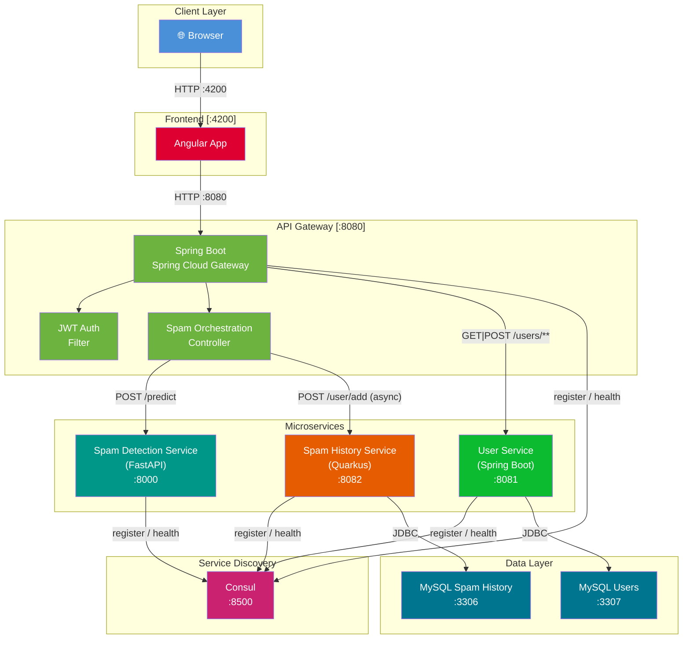

# AI Microservices

A microservices application with spam detection, consisting of:

- **spam-detection-service** — FastAPI + scikit-learn (Multinomial Naive Bayes)
- **api-gateway** — Spring Boot / Spring Cloud Gateway
- **frontend** — Angular served via Nginx

## Architecture

```
Browser (localhost:4200)
    └── api-gateway (localhost:8080)
            └── spam-detection-service (localhost:8000)
```

All services communicate over the internal `microservices-net` Docker bridge network.

## Prerequisites

- [Docker Desktop](https://www.docker.com/products/docker-desktop/)
- [Docker Compose](https://docs.docker.com/compose/) (included with Docker Desktop)

## Running the Project

### Start all services

```bash
docker-compose up -d --build
```

The first build will take a few minutes as it:

- Trains and bakes the spam model into the image
- Compiles the Spring Boot gateway
- Builds the Angular app

### Stop all services

```bash
docker-compose down
```

## Rebuilding After Changes

Only rebuild the service you changed — other services keep running.

| Changed                     | Command                                               |
| --------------------------- | ----------------------------------------------------- |
| Frontend (Angular)          | `docker-compose up -d --build frontend`               |
| API Gateway (Spring Boot)   | `docker-compose up -d --build api-gateway`            |
| Spam service (FastAPI / ML) | `docker-compose up -d --build spam-detection-service` |

## Service URLs

| Service                   | URL                                   |
| ------------------------- | ------------------------------------- |
| Frontend                  | http://localhost:4200                 |
| API Gateway               | http://localhost:8080                 |
| Spam Detection (direct)   | http://localhost:8000                 |
| Gateway health            | http://localhost:8080/actuator/health |
| Spam health (via gateway) | http://localhost:8080/spam/health     |

## API

### POST /spam/predict (via gateway)

```http
POST http://localhost:8080/spam/predict
Content-Type: application/json

{
  "text": "Congratulations! You won a free prize, click here now!"
}
```

Response:

```json
{
  "category": "spam",
  "spam_probability": 0.9731
}
```

`category` is either `"spam"` or `"not spam"`.

## Viewing Logs

```bash
# All services
docker-compose logs -f

# Single service
docker-compose logs -f spam-detection-service
docker-compose logs -f api-gateway
docker-compose logs -f frontend
```

DIAGRAM (https://mermaid.live/edit)
